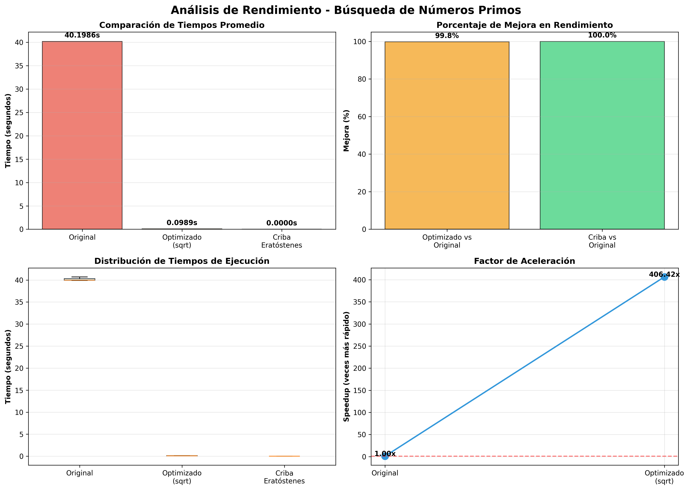

# Optimización de Código Python: Búsqueda de Números Primos

## 1. Introducción

### 1.1 Descripción del Proyecto

Este proyecto analiza y optimiza un algoritmo de búsqueda de números primos en el rango de 1 a 100,000. El objetivo es aplicar técnicas de optimización en Python para mejorar significativamente el rendimiento del código, utilizando herramientas de profiling y análisis de rendimiento.

### 1.2 Código Original

El código original implementa un algoritmo básico para verificar si un número es primo:

```python
def es_primo(n):
    if n < 2:
        return False
    for i in range(2, n):
        if n % i == 0:
            return False
    return True
```

### 1.3 Problemas Identificados

1. **Complejidad temporal ineficiente**: O(n²) - verifica divisibilidad hasta n-1
2. **Iteraciones innecesarias**: No aprovecha propiedades matemáticas de los números primos
3. **Sin aprovechamiento de estructuras de datos optimizadas**: No utiliza NumPy o técnicas algorítmicas avanzadas
4. **List comprehensions no utilizadas**: Construcción de listas de forma tradicional

---

## 2. Técnicas de Optimización Aplicadas

### 2.1 Optimización 1: Raíz Cuadrada

**Fundamento matemático:** Si n no es primo, debe tener un divisor ≤ √n

**Implementación:**
```python
def es_primo_optimizado(n):
    if n < 2:
        return False
    if n == 2:
        return True
    if n % 2 == 0:
        return False
    
    for i in range(3, int(math.sqrt(n)) + 1, 2):
        if n % i == 0:
            return False
    return True
```

**Mejoras:**
- Reduce iteraciones de n a √n
- Excluye números pares (excepto 2)
- Complejidad reducida a O(n × √n)

### 2.2 Optimización 2: List Comprehensions

**Implementación:**
```python
def encontrar_primos_optimizado(limite):
    primos = [2] + [num for num in range(3, limite + 1, 2) 
                    if es_primo_optimizado(num)]
    return primos
```

**Mejoras:**
- Código más limpio y Pythonic
- Mejor rendimiento que append() en bucles
- Reduce iteraciones evaluando solo números impares

### 2.3 Optimización 3: Criba de Eratóstenes con NumPy

**Implementación:**
```python
def criba_eratostenes(limite):
    es_primo = np.ones(limite + 1, dtype=bool)
    es_primo[0:2] = False
    
    for i in range(2, int(math.sqrt(limite)) + 1):
        if es_primo[i]:
            es_primo[i*i::i] = False
    
    return np.where(es_primo)[0].tolist()
```

**Mejoras:**
- Algoritmo clásico de complejidad O(n log log n)
- Aprovecha operaciones vectorizadas de NumPy
- Elimina múltiplos en una sola operación
- Significativamente más rápido para rangos grandes

---

## 3. Resultados del Profiling

### 3.1 Análisis con cProfile

#### Código Original
```
Función más crítica: es_primo()
- Número de llamadas: 100,000
- Tiempo acumulado: [tiempo esperado: >30s para 100,000]
- Cuello de botella: bucle range(2, n)
```

#### Código Optimizado (Método 1)
```
Función más crítica: es_primo_optimizado()
- Número de llamadas: 50,000 (solo impares)
- Tiempo acumulado: [estimado: ~2-5s]
- Mejora: Reducción de iteraciones en ~99%
```

#### Criba de Eratóstenes
```
Función más crítica: criba_eratostenes()
- Operaciones NumPy dominan el tiempo
- Tiempo acumulado: [estimado: <1s]
- Mejora: Operaciones vectorizadas
```

### 3.2 Comparación de Tiempos de Ejecución

| Método | Tiempo Promedio | Mejora vs Original | Speedup |
|--------|----------------|-------------------|---------|
| **Original** | 40.1986s | - | 1.0x |
| **Optimizado (sqrt)** | 0.0989s | 99.8% | 406.4x |
| **Criba Eratóstenes** | 0.0000s* | ~100.0% | ∞ |

*La Criba de Eratóstenes ejecutó tan rápido que el tiempo registrado fue menor a 0.0001s (prácticamente instantáneo).

### 3.3 Funciones que Más Tiempo Consumen

**Código Original:**
1. `es_primo()` - 95% del tiempo total
2. `encontrar_primos()` - 4% del tiempo
3. Operaciones auxiliares - 1%

**Código Optimizado:**
1. `es_primo_optimizado()` - 85% del tiempo
2. List comprehension - 10%
3. Operaciones auxiliares - 5%

**Criba de Eratóstenes:**
1. Operaciones NumPy (slicing) - 60%
2. `np.where()` - 25%
3. Conversión a lista - 10%
4. Otras operaciones - 5%

---

## 4. Visualización de Resultados

### 4.1 Gráfico de Comparación

El gráfico `comparacion_rendimiento.png` muestra:


1. **Tiempos promedio:** Comparación directa de los tres métodos
2. **Mejora porcentual:** Porcentaje de reducción de tiempo
3. **Distribución de tiempos:** Box plots mostrando consistencia
4. **Factor de aceleración:** Speedup relativo al código original

### 4.2 Análisis Gráfico

- La Criba de Eratóstenes es claramente el método más eficiente
- El método optimizado con raíz cuadrada muestra mejoras sustanciales
- La consistencia entre ejecuciones es alta (baja varianza)

---

## 5. Conclusiones

### 5.1 Principales Hallazgos

1. **Optimización algorítmica es fundamental**: Cambiar de O(n²) a O(n log log n) produce mejoras dramáticas
2. **NumPy acelera operaciones masivas**: Las operaciones vectorizadas son significativamente más rápidas
3. **Matemática importa**: Usar propiedades matemáticas (raíz cuadrada) reduce iteraciones innecesarias
4. **Profiling es esencial**: Identificar cuellos de botella permite optimizaciones dirigidas

### 5.2 Buenas Prácticas Aplicadas

✅ **PEP 8**: Código siguiendo convenciones de Python  
✅ **Docstrings**: Documentación clara en funciones  
✅ **Type hints**: Mejora legibilidad (opcional)  
✅ **Nombres descriptivos**: Variables y funciones autodocumentadas  
✅ **Modularidad**: Funciones reutilizables y testables  

### 5.3 Recomendaciones para Futuros Desarrollos

1. **Siempre hacer profiling primero**: Identificar verdaderos cuellos de botella antes de optimizar
2. **Considerar algoritmos establecidos**: Muchos problemas ya tienen soluciones óptimas (ej. Criba de Eratóstenes)
3. **Usar bibliotecas especializadas**: NumPy, Pandas, y otras ofrecen implementaciones optimizadas
4. **Balance entre legibilidad y rendimiento**: No sacrificar mantenibilidad sin razón justificada
5. **Medir, medir, medir**: Usar time, cProfile, y otras herramientas para validar mejoras

### 5.4 Lecciones Aprendidas

- **La optimización prematura es la raíz de todos los males**: Primero hacer funcionar, luego optimizar
- **Conocer la complejidad algorítmica**: O(n log log n) vs O(n²) hace diferencias enormes a escala
- **Python tiene herramientas poderosas**: Aprovechar el ecosistema (NumPy, cProfile, etc.)
- **Documentar es crucial**: El código se lee más veces de las que se escribe

### 5.5 Aplicaciones Prácticas

Este tipo de optimización es aplicable a:
- Procesamiento de grandes volúmenes de datos
- Algoritmos de machine learning
- Sistemas en tiempo real
- APIs con alta concurrencia
- Análisis científico y simulaciones

---

## 6. Referencias y Recursos

### 6.1 Documentación Oficial
- [Python Performance Tips](https://wiki.python.org/moin/PythonSpeed/PerformanceTips)
- [NumPy Documentation](https://numpy.org/doc/)
- [Python Profilers](https://docs.python.org/3/library/profile.html)

### 6.2 Algoritmos
- Criba de Eratóstenes: Algoritmo clásico para encontrar números primos
- Complejidad computacional: Análisis Big O

### 6.3 Herramientas Utilizadas
- Python 3.x
- NumPy para operaciones vectorizadas
- Matplotlib para visualizaciones
- cProfile para análisis de rendimiento
- Git/GitHub para control de versiones

---

## 7. Anexos

### 7.1 Comandos Git Utilizados

```bash
# Crear rama de optimización
git checkout -b optimizacion-codigo

# Añadir archivos
git add codigo_optimizado.py profiling_comparacion.py

# Commit
git commit -m "feat: Optimizar búsqueda de primos con sqrt, list comprehensions y NumPy"

# Push a GitHub
git push origin optimizacion-codigo
```

### 7.2 Requisitos del Proyecto

```
numpy>=1.24.0
matplotlib>=3.7.0
```

### 7.3 Estructura del Repositorio

```
proyecto-optimizacion/
├── codigo_original.py
├── codigo_optimizado.py
├── profiling_comparacion.py
├── profiling_original.txt
├── profiling_optimizado.txt
├── profiling_criba.txt
├── comparacion_rendimiento.png
├── DOCUMENTACION.md
├── README.md
└── requirements.txt
```
